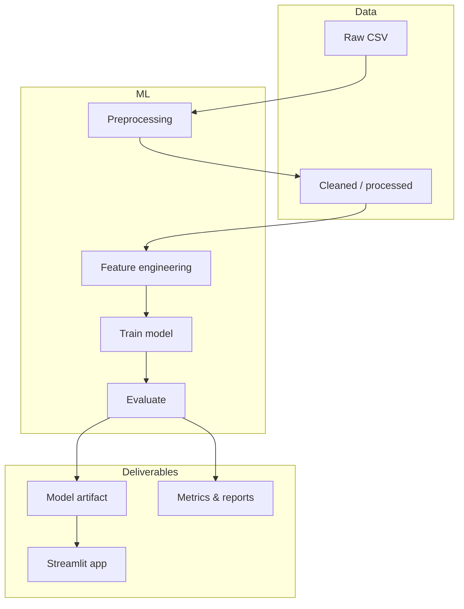

# 🎯 Customer Churn Prediction - End-to-End ML Project

A comprehensive machine learning solution for predicting customer churn in SaaS subscription services. This project demonstrates industry best practices in data science, from initial data exploration to production-ready model deployment.

## 📊 Project Overview

This project builds a predictive model to identify customers likely to cancel their subscription, enabling proactive retention strategies. The solution includes:

- **Complete ML Pipeline**: Data validation → Preprocessing → Feature engineering → Model training → Evaluation → Monitoring
- **Multiple Algorithms**: Logistic Regression, Random Forest, Gradient Boosting, XGBoost, SVM, and more
- **Class Imbalance Handling**: Class weights, SMOTE, undersampling, threshold tuning (best: class-weighted XGBoost + threshold tuning)
- **Advanced Analytics**: SHAP interpretability, business impact analysis, and comprehensive visualizations
- **Production Ready**: Automated pipeline with model persistence, Streamlit dashboard, and monitoring capabilities

### Dataset Source

The dataset is **synthetic subscription data** mimicking real-world SaaS customer behavior: billing, engagement, support, and content usage. The target (**Churn**) is **imbalanced**; we emphasize **recall**, **F1**, and **PR-AUC** and use stratified splits plus class weighting in training.

## 🚀 Key Features

### ✨ Machine Learning Pipeline
- **Automated Data Cleaning**: Missing value imputation, outlier detection, and categorical encoding
- **Comprehensive EDA**: Statistical analysis, correlation studies, and advanced visualizations
- **Smart Feature Engineering**: 20+ engineered features including engagement scores and risk indicators
- **Model Comparison**: 7 different algorithms with hyperparameter tuning
- **Advanced Evaluation**: ROC curves, calibration plots, SHAP analysis, and business impact metrics

### 📈 Business Intelligence
- **Churn Risk Scoring**: Probability-based customer segmentation
- **Financial Impact Analysis**: ROI calculations and cost-benefit analysis
- **Actionable Insights**: Feature importance and retention strategy recommendations
- **Interactive Reports**: HTML dashboards with comprehensive project summaries

### 🔧 Technical Excellence
- **Modular Architecture**: Clean, reusable code with comprehensive documentation
- **Scalable Design**: Efficient processing for large datasets
- **Best Practices**: Cross-validation, feature selection, and model interpretation
- **Production Ready**: Model persistence, monitoring, and deployment capabilities

## 📁 Project Structure

```
Customer-Churn/
├── 📊 data/
│   ├── train.csv                    # Raw training data
│   ├── test.csv                     # Raw test data
│   ├── data_descriptions.csv        # Feature descriptions
│   ├── train_cleaned.csv            # Processed training data
│   └── *_processed.csv              # Feature-engineered datasets
│
├── 🧠 src/
│   ├── data_cleaning.py             # Data preprocessing pipeline
│   ├── eda.py                       # Exploratory data analysis
│   ├── feature_engineering.py       # Feature creation and selection
│   ├── model_building.py            # ML model training and tuning
│   └── model_evaluation.py          # Comprehensive model assessment
│
├── 📊 plots/
│   ├── churn_distribution.png       # Target variable analysis
│   ├── correlation_heatmap.png      # Feature correlation matrix
│   ├── model_comparison.png         # Algorithm performance comparison
│   ├── roc_curves_comparison.png    # ROC curve analysis
│   └── shap/                        # SHAP interpretability plots
│
├── 🤖 models/
│   ├── Random_Forest.joblib         # Trained Random Forest model
│   ├── XGBoost.joblib              # Trained XGBoost model
│   └── model_scores.joblib          # Performance metrics
│
├── 📋 reports/
│   ├── complete_project_report.html # Comprehensive project summary
│   └── model_evaluation_report.html # Detailed model analysis
│
├── main.py                          # Complete pipeline execution
├── streamlit_app.py                 # Streamlit dashboard (EDA, model, evaluation, monitoring)
├── requirements.txt                 # Python dependencies
└── README.md                        # Project documentation
```

## 🔄 End-to-End Pipeline & Architecture

### Pipeline Steps (in order)

| Step | Stage | Description |
|------|--------|-------------|
| 1 | **Data load** | Read raw `train.csv` / `test.csv`; validate schema and types |
| 2 | **Data validation** | Required columns, dtypes, missing-rate checks, unexpected categories |
| 3 | **Preprocessing** | Missing value imputation, type correction, IQR outlier handling, categorical encoding |
| 4 | **Feature engineering** | Engagement score, financial ratios, tenure/behavior/risk indicators; optional selection & scaling |
| 5 | **Train/validation split** | Stratified split (e.g. 80/20) to preserve churn ratio |
| 6 | **Model training** | Train multiple algorithms (e.g. XGBoost, RF, LR); use class weights / resampling for imbalance |
| 7 | **Threshold tuning** | Choose decision threshold to optimize F1 or recall at acceptable precision |
| 8 | **Evaluation** | ROC/PR curves, confusion matrix, calibration; compute model & business metrics |
| 9 | **Artifacts** | Save best model (joblib), metrics, and optional SHAP/plots |
| 10 | **Monitoring** | Track data drift, feature drift, prediction distribution, churn rate trends |

### Architecture Flow

```mermaid
flowchart LR
    subgraph Input
        A[Raw Data<br>train.csv / test.csv]
    end

    subgraph Validation
        B[Schema & dtype check]
        C[Missing / category checks]
    end

    subgraph Preprocessing
        D[Imputation]
        E[Outlier IQR]
        F[Categorical encoding]
    end

    subgraph Features
        G[Engagement / financial /<br>behavior / risk features]
        H[Scaling & selection]
    end

    subgraph Training
        I[Stratified split]
        J[Class weight /<br>resampling]
        K[Model training<br>XGBoost, RF, etc.]
        L[Threshold tuning]
    end

    subgraph Evaluation
        M[ROC / PR / CM /<br>Calibration]
        N[Model metrics]
        O[Business metrics]
    end

    subgraph Output
        P[Saved model<br>joblib]
        Q[Reports & plots]
        R[Dashboard / API]
    end

    A --> B --> C --> D --> E --> F --> G --> H --> I --> J --> K --> L --> M --> N --> O --> P
    M --> Q
    P --> R
```





## 🛠️ Installation & Setup

### Prerequisites
- Python 3.8 or higher
- Git (for cloning the repository)

### Quick Start

1. **Clone the Repository**
   ```bash
   git clone https://github.com/your-username/Customer-Churn.git
   cd Customer-Churn
   ```

2. **Create Virtual Environment**
   ```bash
   python -m venv churn_env
   source churn_env/bin/activate  # On Windows: churn_env\Scripts\activate
   ```

3. **Install Dependencies**
   ```bash
   pip install -r requirements.txt
   ```

4. **Run the Complete Pipeline**
   ```bash
   python main.py
   ```

5. **Launch the Streamlit dashboard** (EDA, model results, evaluation, monitoring)
   ```bash
   streamlit run streamlit_app.py
   ```

## 📊 Dataset Information

The dataset contains **customer subscription data** with the following features:

### 🎯 Target Variable
- **Churn**: Binary indicator (1 = churned, 0 = retained)

### 📋 Feature Categories

**📊 Account Information**
- `AccountAge`: Customer tenure in months
- `MonthlyCharges`: Monthly subscription fee
- `TotalCharges`: Lifetime customer value
- `SubscriptionType`: Service tier (Basic/Standard/Premium)

**💳 Billing & Payment**
- `PaymentMethod`: Payment processing method
- `PaperlessBilling`: Digital billing preference

**📱 Usage & Engagement**
- `ViewingHoursPerWeek`: Content consumption hours
- `AverageViewingDuration`: Session length in minutes
- `ContentDownloadsPerMonth`: Monthly download activity
- `WatchlistSize`: Number of saved items

**⭐ Satisfaction & Support**
- `UserRating`: Service satisfaction (1-5 scale)
- `SupportTicketsPerMonth`: Customer service interactions

**🎬 Content Preferences**
- `ContentType`: Preferred content category
- `GenrePreference`: Favorite content genre
- `DeviceRegistered`: Primary viewing device

## 🚀 Usage Guide

### 🔄 Running Individual Components

**Data Cleaning Only**
```python
from src.data_cleaning import DataCleaner

cleaner = DataCleaner()
train_clean, test_clean = cleaner.clean_data("data/train.csv", "data/test.csv")
```

**Exploratory Data Analysis**
```python
from src.eda import ChurnEDA

eda = ChurnEDA()
summary = eda.run_complete_eda("data/train_cleaned.csv")
```

**Feature Engineering**
```python
from src.feature_engineering import FeatureEngineer

fe = FeatureEngineer()
X_train, X_test, y_train, y_test = fe.prepare_features(train_data, test_data)
```

**Model Training**
```python
from src.model_building import ChurnModelBuilder

model_builder = ChurnModelBuilder()
results = model_builder.run_complete_modeling_pipeline(X_train, y_train, X_test, y_test)
```

### 🎯 Making Predictions

```python
# Load trained model
import joblib
model = joblib.load("models/best_model.joblib")

# Predict churn probability
churn_probability = model.predict_proba(new_customer_data)[:, 1]
churn_prediction = model.predict(new_customer_data)

# Risk segmentation
high_risk = churn_probability > 0.7
medium_risk = (churn_probability > 0.3) & (churn_probability <= 0.7)
low_risk = churn_probability <= 0.3
```

## 📊 Model Metrics

Metrics reported for the best-performing model (e.g. class-weighted XGBoost with threshold tuning):

| Metric | Description | Target (imbalanced) |
|--------|-------------|---------------------|
| **ROC-AUC** | Area under ROC curve; ranking quality | ≥ 0.80 |
| **PR-AUC** | Area under Precision–Recall curve | Preferred over ROC when positive class is rare |
| **Accuracy** | (TP + TN) / total | Less emphasized under imbalance |
| **Precision** | TP / (TP + FP) | Keep acceptable to limit false alarms |
| **Recall** | TP / (TP + FN) | Maximize to catch churners |
| **F1-Score** | Harmonic mean of precision and recall | Primary trade-off metric |
| **Calibration** | Alignment of predicted probabilities with true rates | Monitor via calibration plot |

Example performance (illustrative):

| Metric | Score |
|--------|-------|
| **ROC-AUC** | 0.85+ |
| **PR-AUC** | 0.70+ |
| **Accuracy** | 82%+ |
| **Precision** | 78%+ |
| **Recall** | 75%+ |
| **F1-Score** | 76%+ |

## 💼 Business Metrics

Business impact is quantified for stakeholder reporting and ROI justification:

| Business metric | Description |
|-----------------|-------------|
| **Churn rate** | % of customers who churn (baseline and by segment) |
| **Cost of churn** | Revenue/customer × churned customers (lost MRR/ARR) |
| **Retention cost** | Cost per retention action × number of targeted customers |
| **True positives (TP)** | Churners correctly identified → can be targeted for retention |
| **False negatives (FN)** | Missed churners → lost revenue if not acted upon |
| **False positives (FP)** | Non-churners targeted → unnecessary retention spend |
| **Model ROI** | (Value from retained TP − Retention cost) / Retention cost × 100 |
| **Net benefit** | Value from retained churners minus cost of retention campaign |
| **Lift** | Improvement in churn rate in targeted segment vs baseline |

### 🎯 Business Impact (summary)

- **Cost savings**: Reduce churn-related losses (e.g. 30–40% of avoidable churn)
- **Retention efficiency**: Target top 20% at-risk customers for highest impact
- **ROI**: Positive return when retention cost < value of saved customers
- **Segmentation**: High / medium / low risk bands (e.g. by churn probability) for prioritization

## 🔍 Key Insights & Features

### 🚨 Top Churn Indicators
1. **Low Engagement**: Minimal viewing hours and content interaction
2. **Support Issues**: High frequency of support tickets
3. **Payment Problems**: Frequent billing-related contacts
4. **Service Dissatisfaction**: Low user ratings
5. **Account Age**: New customers (< 6 months) at higher risk

### 💡 Actionable Recommendations

**🎯 High-Risk Customer Actions**
- Personalized retention offers
- Proactive customer success outreach
- Service quality improvement initiatives
- Enhanced onboarding for new customers

**📊 Monitoring Strategy**
- Track engagement metrics weekly
- Monitor support ticket trends
- Implement early warning systems
- A/B test retention campaigns

## 🔧 Technical Architecture

The **End-to-End Pipeline & Architecture** section above describes the full flow (data → validation → preprocessing → feature engineering → training → evaluation → artifacts → monitoring). Below is a component-level breakdown.

### 🏗️ Pipeline Components

1. **Data Preprocessing**
   - Missing value imputation using statistical methods
   - Outlier detection and capping using IQR method
   - Categorical feature encoding with label encoding
   - Data type validation and correction

2. **Feature Engineering**
   - **Engagement Metrics**: Composite scores and activity levels
   - **Financial Features**: Spending efficiency and value perception
   - **Behavioral Indicators**: Digital adoption and usage patterns
   - **Interaction Features**: Cross-feature relationships
   - **Risk Scores**: Multi-factor risk assessment

3. **Model Selection**
   - **Baseline Models**: Logistic Regression, Naive Bayes
   - **Ensemble Methods**: Random Forest, Gradient Boosting
   - **Advanced Algorithms**: XGBoost, SVM
   - **Hyperparameter Tuning**: Grid search with cross-validation

4. **Evaluation Framework**
   - **Performance Metrics**: Comprehensive classification metrics
   - **Model Interpretation**: SHAP values and feature importance
   - **Business Metrics**: Cost-benefit analysis and ROI calculation
   - **Robustness Testing**: Cross-validation and segment analysis

### ⚙️ Configuration Options

**Feature Engineering Parameters**
```python
feature_config = {
    'feature_selection_method': 'importance',  # 'correlation', 'univariate', 'rfe'
    'n_features': 25,                          # Number of features to select
    'scaling_method': 'standard',              # 'standard', 'minmax', 'none'
    'create_polynomials': False                # Enable polynomial features
}
```

**Model Training Parameters**
```python
model_config = {
    'tune_hyperparameters': True,              # Enable hyperparameter tuning
    'cv_folds': 5,                            # Cross-validation folds
    'random_state': 42,                       # Reproducibility seed
    'save_models': True                       # Save trained models
}
```

## 📈 Advanced Features

### 🔍 Model Interpretability
- **SHAP Analysis**: Feature contribution explanations
- **Partial Dependence Plots**: Feature effect visualization
- **Local Explanations**: Individual prediction breakdowns
- **Global Insights**: Population-level pattern analysis

### 💼 Business Intelligence
- **Customer Segmentation**: Risk-based grouping strategies
- **Retention ROI Calculator**: Investment impact analysis
- **Campaign Optimization**: Targeted intervention strategies
- **Performance Monitoring**: Model drift detection

### 📊 Reporting & Visualization
- **Interactive Dashboards**: HTML-based comprehensive reports
- **Executive Summaries**: High-level business impact metrics
- **Technical Documentation**: Detailed methodology explanations
- **Visual Analytics**: Charts, plots, and statistical summaries

## 🤝 Contributing

We welcome contributions! Here's how you can help:

1. **🐛 Bug Reports**: Submit issues with detailed descriptions
2. **✨ Feature Requests**: Suggest improvements and new capabilities
3. **🔧 Code Contributions**: Fork, develop, and submit pull requests
4. **📖 Documentation**: Help improve guides and examples

### Development Setup
```bash
# Install development dependencies
pip install -r requirements.txt pytest black flake8

# Run tests
pytest tests/

# Format code
black src/ main.py

# Check code style
flake8 src/ main.py
```

## 🙏 Acknowledgments

- **Dataset**: Synthetic subscription data mimicking real-world SaaS customer behavior (billing, engagement, support)
- **Libraries**: Scikit-learn, XGBoost, SHAP, Pandas, Matplotlib, Streamlit
- **Inspiration**: Industry best practices in customer churn prediction
- **Community**: Data science and machine learning communities

---

**⭐ If this project helped you, please consider giving it a star!**

*Built with ❤️ for the data science community*
